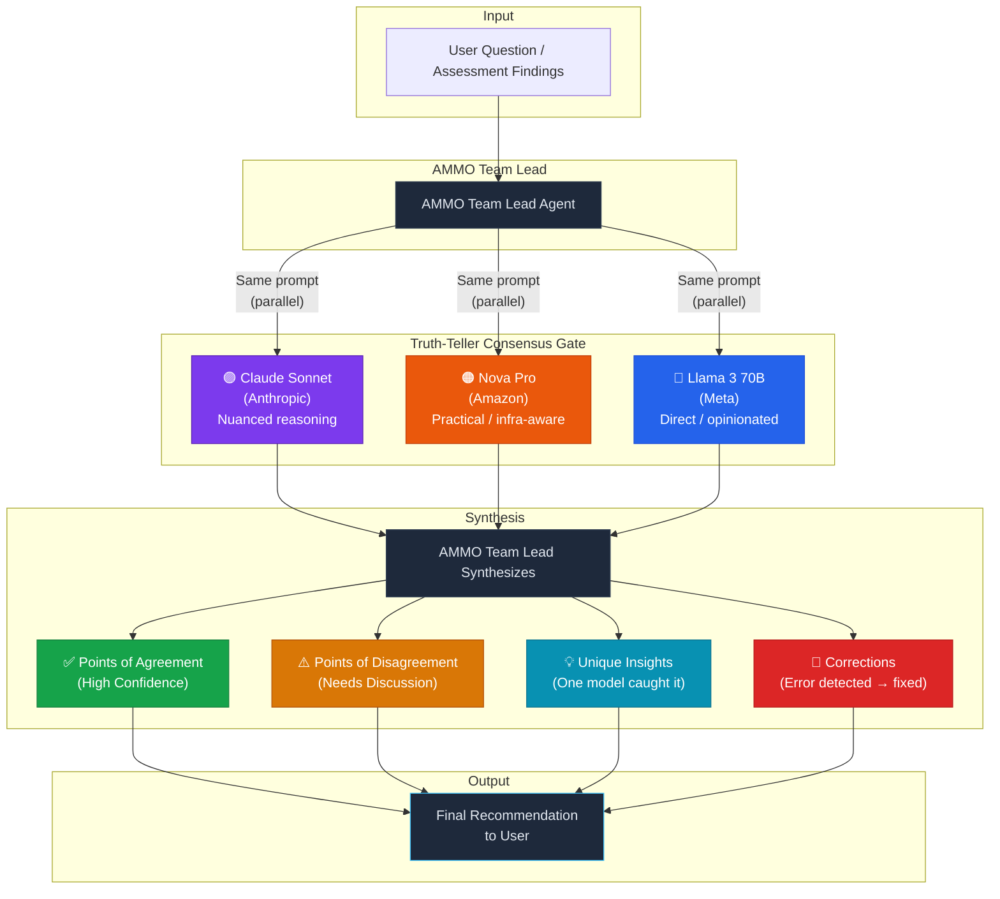

# Truth-Teller Consensus — How It Works

## Overview

The Truth-Teller Consensus is a multi-model verification gate. Three AI models from **different vendors and architectures** independently review the same findings, then the AMMO Team Lead synthesizes their perspectives into a single recommendation.

This ensures no single model's blind spots, biases, or training gaps go unchecked.

## The Three Models

| Truth-Teller | Model | Vendor | Why It's Different |
|-------------|-------|--------|-------------------|
| **Sonnet** | Claude Sonnet | Anthropic | Nuanced reasoning, catches subtle architectural risks, strong at reading between the lines |
| **Nova** | Amazon Nova Pro | Amazon | Practical, infrastructure-aware, AWS-native perspective |
| **Llama** | Llama 3 70B Instruct | Meta | Direct, opinionated, trained on different data — surfaces findings the others miss |

## Consensus Flow

## What the Gate Catches

| Scenario | What Happens |
|----------|-------------|
| All three agree on a finding | **High confidence** — finding proceeds into the report unchanged |
| Two agree, one disagrees | **Flagged for review** — disagreement is surfaced to the user with both perspectives |
| One model catches a risk the others missed | **Added** — unique insights from any single model are included |
| One model identifies a factual error | **Corrected** — errors are fixed before the report is written |
| All three disagree | **Escalated to user** — the user decides; the platform doesn't guess |

## Why Three Different Vendors

Using three models from the **same vendor** (e.g., three Amazon Nova variants) produces correlated blind spots — they share training data, architecture, and failure modes. Genuine diversity requires different model families:

- **Anthropic** (Claude) — Constitutional AI training, strong on safety and nuance
- **Amazon** (Nova) — Built for AWS workloads, pragmatic
- **Meta** (Llama) — Open-weight, community-tuned, different training corpus

When all three independently reach the same conclusion from different starting points, confidence is high. When they diverge, that divergence itself is valuable signal.
