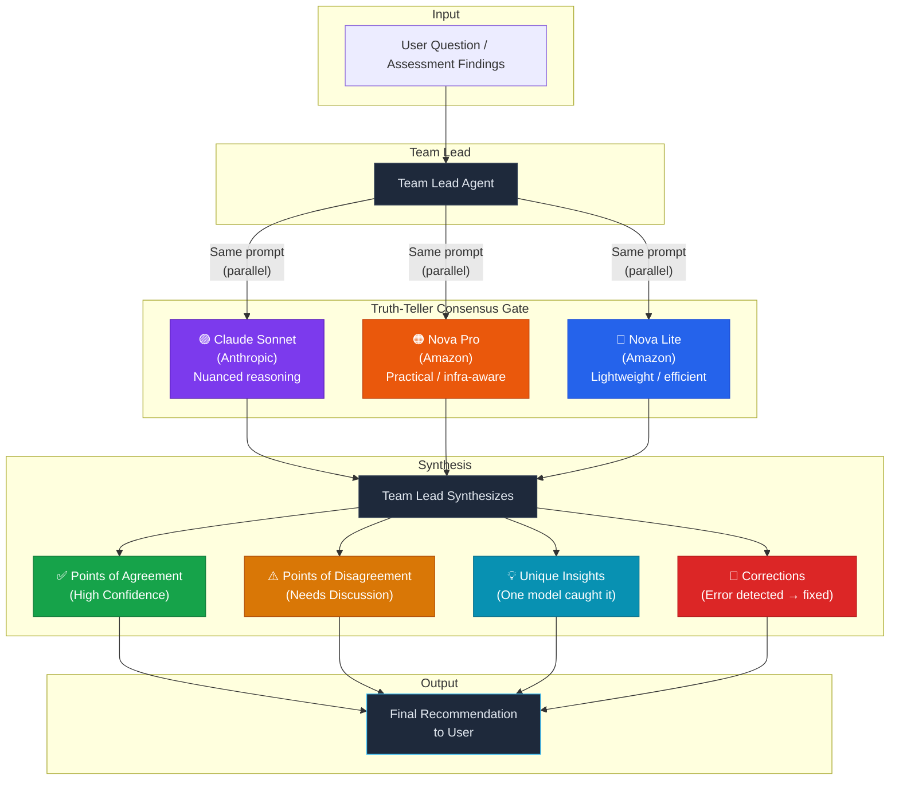

<!-- ANRCODE_CHANGE {"issue":383,"branch":"anr/383/move-ammo-to-aitemplates-doco","date":"2026-07-30"} -->
# Truth-Teller Consensus — How It Works

## Overview

The Truth-Teller Consensus is a multi-model verification gate. Three AI models with **different architectures and optimization targets** independently review the same findings, then the Team Lead synthesizes their perspectives into a single recommendation.

This ensures no single model's blind spots, biases, or training gaps go unchecked.

## The Three Models

| Truth-Teller | Model | Vendor | Why It's Different |
|-------------|-------|--------|-------------------|
| **Sonnet** | Claude Sonnet | Anthropic | Nuanced reasoning, catches subtle architectural risks, strong at reading between the lines |
| **Nova** | Amazon Nova Pro | Amazon | Practical, infrastructure-aware, AWS-native perspective |
| **Lite** | Amazon Nova Lite | Amazon | Lightweight, fast, cost-efficient model — different parameter scale surfaces different findings |

## Consensus Flow

```mermaid
graph TD
    subgraph Input
        U[User Question / Assessment Findings]
    end

    subgraph "Team Lead"
        O[Team Lead Agent]
    end

    subgraph "Truth-Teller Consensus Gate"
        direction LR
        TT1["🟣 Claude Sonnet<br/>(Anthropic)<br/>Nuanced reasoning"]
        TT2["🟠 Nova Pro<br/>(Amazon)<br/>Practical / infra-aware"]
        TT3["🔵 Nova Lite<br/>(Amazon)<br/>Lightweight / efficient"]
    end

    subgraph Synthesis
        S[Team Lead Synthesizes]
        A["✅ Points of Agreement<br/>(High Confidence)"]
        D["⚠️ Points of Disagreement<br/>(Needs Discussion)"]
        I["💡 Unique Insights<br/>(One model caught it)"]
        C["🔴 Corrections<br/>(Error detected → fixed)"]
    end

    subgraph Output
        R[Final Recommendation<br/>to User]
    end

    U --> O
    O -->|"Same prompt<br/>(parallel)"| TT1
    O -->|"Same prompt<br/>(parallel)"| TT2
    O -->|"Same prompt<br/>(parallel)"| TT3
    TT1 --> S
    TT2 --> S
    TT3 --> S
    S --> A
    S --> D
    S --> I
    S --> C
    A --> R
    D --> R
    I --> R
    C --> R

    style TT1 fill:#7c3aed,stroke:#5b21b6,color:#fff
    style TT2 fill:#ea580c,stroke:#c2410c,color:#fff
    style TT3 fill:#2563eb,stroke:#1d4ed8,color:#fff
    style A fill:#16a34a,stroke:#15803d,color:#fff
    style D fill:#d97706,stroke:#b45309,color:#fff
    style I fill:#0891b2,stroke:#0e7490,color:#fff
    style C fill:#dc2626,stroke:#b91c1c,color:#fff
    style O fill:#1e293b,stroke:#334155,color:#e2e8f0
    style S fill:#1e293b,stroke:#334155,color:#e2e8f0
    style R fill:#1e293b,stroke:#38bdf8,color:#e2e8f0
```

## What the Gate Catches

| Scenario | What Happens |
|----------|-------------|
| All three agree on a finding | **High confidence** — finding proceeds into the report unchanged |
| Two agree, one disagrees | **Flagged for review** — disagreement is surfaced to the user with both perspectives |
| One model catches a risk the others missed | **Added** — unique insights from any single model are included |
| One model identifies a factual error | **Corrected** — errors are fixed before the report is written |
| All three disagree | **Escalated to user** — the user decides; the platform doesn't guess |

## Why Two Amazon Models Plus Anthropic

Using three models from the **same vendor and same size class** produces correlated blind spots. Nova Pro and Nova Lite differ in parameter scale and optimization target, which means they diverge on cost-sensitivity, complexity thresholds, and infrastructure trade-offs. Combined with Claude's constitutional AI perspective, the trio still provides meaningful signal diversity:

- **Anthropic** (Claude Sonnet) — Constitutional AI training, strong on safety and nuance
- **Amazon** (Nova Pro) — Built for AWS workloads, pragmatic, full-capability model
- **Amazon** (Nova Lite) — Lightweight variant; catches different cost/complexity trade-offs than Nova Pro

When all three independently reach the same conclusion, confidence is high. When they diverge, that divergence itself is valuable signal.
